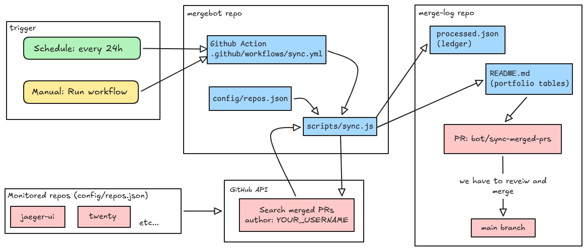

# MergeBot

A small GitHub Action that watches your open-source repos for merged PRs and opens update PRs on [mergelog](https://github.com/parshipcy/mergelog).



## How to use it

**You need two repos**:

| Repo | Purpose |
|------|---------|
| **mergebot** (this one) | Bot code + GitHub Action |
| **mergelog** (yours) | Public README + `processed.json` |

**Setup**:

1. Fork or clone this repo, and create a second repo for your portfolio (e.g. `your-username/mergelog`).
2. Create a [fine-grained PAT](https://github.com/settings/tokens) with **Contents** and **Pull requests** access to both repos.
3. Add the PAT as `POW_REPO_TOKEN` in **mergebot → Settings  Secrets → Actions**.
4. Edit `config/repos.json` with the repos you want to watch.
5. In `.github/workflows/sync.yml`, replace `parshipcy/mergelog` and `GITHUB_USERNAME` with yours.
6. Seed your mergelog repo on `main` with `processed.json` (`{ "processed": [], "entries": [] }`) and a `README.md` that includes `<!-- mergebot:start -->` and `<!-- mergebot:end -->`.
7. Push mergebot to GitHub, then run the workflow from **Actions → Run workflow**.

The action syncs merged PRs and opens a PR on your mergelog repo. Review and merge it to update your portfolio.

**Local test**:

```bash
npm install
git clone https://github.com/YOUR_USERNAME/mergelog.git pow
# create .env with POW_REPO_TOKEN, GITHUB_USERNAME, POW_DIR=pow
npm run sync:local
```
---
Made with ❤️ by Parship
